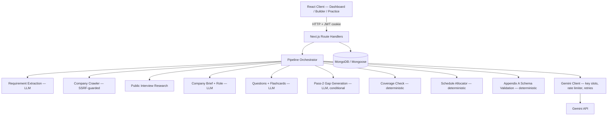

# The AI Interview Prep Kit

> Turns a job description, a company website, and an interview timeline into a personalized, editable interview preparation workspace.

## Overview

Interview preparation is usually scattered across job postings, company careers pages, blog posts, and memory. The AI Interview Prep Kit consolidates that process: you provide a job description, the company website, and the number of days you have available; the system researches the company, analyzes the role, searches public interview-process discussions, generates categorized interview questions and flashcards, verifies that every must-have requirement is covered, and lays everything out on a day-by-day study schedule.

The workflow at a glance:

```
Job Description ─┐
                 ├─► Research ─► Requirement Extraction ─► Role + Company Analysis
Company URL ─────┤                                              │
                 ├─► Public Interview Research ────────────────►│
Days Available ──┘                                              ▼
                                                 Question + Flashcard Generation
                                                            │
                                                            ▼
                                                  Deterministic Coverage Check
                                                            │
                                          ┌─────────────────┴─────────────────┐
                                          ▼                                   ▼
                                  Uncovered MUST requirements          All MUST covered
                                          │                                   │
                                          ▼                                   │
                                  Second-Pass Gap Generation                   │
                                          └─────────────┬─────────────────────┘
                                                        ▼
                                              Deterministic Schedule
                                                        │
                                                        ▼
                                              Practice & Refine
```

Partial research never fails a kit: unreachable pages, missing hiring pages, and absent public discussion are recorded as honest gaps so the rest of the kit is still delivered.

## Features

- **Personalized interview preparation** — kits are generated from the exact job description and company URL you provide, tied to your account.
- **Dynamic company research** — the company website is crawled dynamically; useful pages are discovered and ranked at runtime from the links on each page, not from a fixed path list.
- **Public interview-process research** — a public search for interview discussions about the company and role is attempted and its findings feed question generation.
- **Requirement extraction** — the JD is decomposed into atomic requirements classified as technical / behavioural / domain and must / nice priority.
- **Requirement-to-question traceability** — every question and flashcard carries the IDs of the requirements it covers.
- **Coverage analysis** — deterministic application code decides which must-have requirements remain uncovered after the first generation pass.
- **Second-pass gap closure** — uncovered must-have requirements trigger one targeted additional generation pass; the final kit ships with zero uncovered must-have requirements when generation succeeds.
- **Editable question bank** — questions can be added, edited, deleted, reordered with drag and drop, and moved between categories.
- **Section-level regeneration** — the company brief or any question category can be regenerated individually.
- **Edit preservation** — a user-written or user-edited question survives regeneration of its own category; the rest of the kit is never touched by a single-section regeneration.
- **Flashcards** — generated from the same requirements, with confidence tracking.
- **Confidence-based practice** — flashcard review sessions prioritize the lowest-confidence cards first.
- **Deterministic study schedule** — questions are allocated across exactly the number of days you request, with harder and must-have material placed earlier.
- **Authentication and user-owned kits** — registration, login, and per-user kit isolation; every kit query is scoped to the authenticated owner.
- **Batch evaluator** — a CLI harness that runs the full pipeline over a JSON case file for offline verification.

## How It Works

1. You submit a job description, a company URL, and a day count (1–60) from the dashboard.
2. The server creates a kit record in MongoDB with `status: "running"` and starts the pipeline asynchronously; the client polls the kit status endpoint for progress.
3. The pipeline orchestrator runs the multi-stage sequence described under [Generation Pipeline](#generation-pipeline), mixing LLM calls with deterministic application logic.
4. The finished kit is validated against the Appendix A `KitSchema` and persisted. The client renders the builder, schedule timeline, and coverage report.
5. From there you can edit content, regenerate individual sections, reorder questions, and run practice sessions; changes autosave and survive regeneration.

## Architecture



**Layer responsibilities**

- **Route Handlers** (`app/api/`) — authentication, input validation (Zod), kit CRUD, practice ratings, section regeneration, and pipeline invocation. All mutating endpoints require a valid session and scope database queries to the owning user.
- **Pipeline Orchestrator** (`lib/pipeline/orchestrator.ts`) — the single generation path shared by the API and the batch evaluator. It sequences stages, wires earlier outputs into later prompts, and enforces the pass-1 → coverage → pass-2 → schedule → validate loop.
- **Retrieval** (`lib/retrieval/`) — SSRF-guarded fetching, company-site crawling with dynamic link ranking, and public interview-process search.
- **LLM Client** (`lib/llm/client.ts`) — Gemini transport with numbered key slots, a process-wide rate limiter, bounded retries, daily-quota classification, and secret redaction.
- **Domain logic** (`lib/domain/`) — coverage analysis, schedule allocation, regeneration merging, and the internal-to-external kit mapping. All deterministic.
- **Persistence** (`lib/db/`) — Mongoose models for users and kits; kits store both the canonical content and the editing-state flags (`user_edited`, `is_custom`).

**Deterministic vs. delegated to the LLM**

| Concern | Owner |
| :--- | :--- |
| Requirement extraction, brief, questions, flashcards | Gemini (JSON-schema constrained) |
| Coverage decision, pass-2 trigger | Application code |
| Schedule arithmetic, day count, minute totals | Application code |
| Requirement/question/flashcard ID assignment | Application code |
| Regeneration merging, edit preservation | Application code |
| Final kit shape (Appendix A validation) | Application code (Zod) |

## Tech Stack

| Technology | Purpose | Why it was chosen |
| :--- | :--- | :--- |
| Next.js 14 (App Router) | Full-stack framework: UI, API routes, server components | One framework serves the React frontend and the backend APIs, so the pipeline is invoked through the exact same code path in the app and the CLI. |
| TypeScript | Type safety across client, server, and pipeline | Shared Zod schemas (Appendix A/B) are the single source of truth for kit and batch shapes. |
| Bun | Runtime for scripts and tests | Fast execution of the CLI evaluator and the test suite; the app itself runs on Node via Next.js. |
| MongoDB / Mongoose | Persistence for users and kits | Flexible document model fits the nested kit structure; Mongoose gives schema validation and indexing on `kitId`/`userId`. |
| Gemini API | LLM provider | Structured JSON output, generous free tier, and per-project quota pools that the key-slot client is built around. |
| Tailwind CSS | Styling | Utility-first styling keeps the UI layer simple and co-located with components. |
| dnd-kit | Drag-and-drop reordering | Accessible, well-maintained primitives for the builder's reorder interactions. |
| Zod | Runtime validation | Boundary validation for API inputs, LLM outputs, and the final kit. |

**Architecture choice:** the application is intentionally a single Next.js full-stack app rather than a separate frontend/backend pair. The assessment's hard requirement — that the batch evaluator and the web app share one retrieval/generation/validation path — is satisfied structurally: `scripts/evaluate.ts` and `app/api/kits/generate/route.ts` both call the same `runPipeline()`.

## Research & Retrieval

Retrieval is the first pipeline stage and is designed to degrade gracefully.

**Company-site crawling** (`lib/retrieval/crawler.ts`)

1. The submitted company URL passes the SSRF guard, then is fetched with a descriptive `TraoBot/1.0` user agent, an 8-second timeout, and a 500 KB page cap.
2. Each page is cleaned with Cheerio: scripts, styles, navigation, headers, footers, SVGs, and iframes are stripped; the remaining body text is normalized and capped at 10,000 characters.
3. **Hiring-page discovery is dynamic.** Every same-origin link on the page is collected and ranked by a keyword signal (careers, jobs, hiring, work-with-us, join, team, handbook, culture, engineering, interview, values; about/company/mission/story as a weaker signal). The top-ranked links are fetched in order, up to 5 pages total. No fixed `/careers` or `/jobs` path is assumed — those terms only influence ranking.
4. Because ranking is heuristic, the crawler simply takes what it can get: if a high-ranked link is unreachable, it is skipped and the next candidate is tried.

**Public interview-process research** (`lib/retrieval/interviewSearch.ts`)

- A public search query is built from the company name (inferred from the URL hostname) and role title: `"<company> <role> interview process questions discussion"`.
- The result page is fetched through the same SSRF guard and parsed for up to 3 snippets.
- If no discussion exists — or the search fails — the pipeline records an honest gap (`"No public interview process discussions found …"`) and continues.

**Failure behavior**

| Situation | Behavior |
| :--- | :--- |
| URL unreachable / timeout / 404 / non-HTML | Page skipped; logged as a warning; next candidate tried |
| Invalid URL format | Rejected at the API boundary with a validation error |
| Hiring page not found | `hiringInfoText` set to `"No explicit public hiring page found on company site."` |
| No public discussion | Summary records the honest gap; generation proceeds with JD + site content only |
| Oversized page (>500 KB) | Skipped with a warning |
| Redirect into a private address | Blocked by the per-hop SSRF re-validation |

The crawler never fails the whole run because one source was inaccessible — partial research still produces an `ok` kit.

## Generation Pipeline

The pipeline is deliberately **multi-stage**, not one giant prompt. Each stage has a single responsibility, and its output constrains the next stage.

| # | Stage | Type | Responsibility |
| :-: | :--- | :--- | :--- |
| 1 | Requirement extraction | LLM | Decompose the JD into atomic requirements (`text`, `kind`, application-assigned stable IDs `r1, r2, …`, `must`/`nice` priority). |
| 2 | Company crawl + page cleaning | Deterministic | Fetch and clean up to 5 ranked pages (see [Research & Retrieval](#research--retrieval)). |
| 3 | Public interview research | Best-effort | Retrieve public interview-process snippets; honest gap on failure. |
| 4 | Company brief + role analysis | LLM | Synthesize crawled content + research + JD into `company_brief` and a role breakdown. |
| 5 | Pass-1 question + flashcard generation | LLM | Generate categorized questions (`technical`, `behavioural`, `system-design`, `company-fit`) and flashcards referencing requirement IDs. |
| 6 | Coverage check | Deterministic | Compute uncovered must-have requirement IDs (see next section). |
| 7 | Pass-2 gap generation | LLM, conditional | If any must-have requirement is uncovered and fewer than 2 passes have run, generate targeted questions for exactly those requirements. |
| 8 | Coverage recheck | Deterministic | Recompute coverage; with pass 2 executed the kit proceeds regardless (bounded loop). |
| 9 | Schedule allocation | Deterministic | Allocate questions across exactly the requested number of days (see [Scheduling](#scheduling)). |
| 10 | Appendix A validation | Deterministic | `KitSchema.safeParse` must succeed or the case fails honestly with a structured error. |

**How stages influence each other**

- Extracted requirements (stage 1) are the spine of the kit: they are summarized into the stage-5 prompt, referenced by every question/flashcard, and the must-have subset drives stages 6–8.
- Crawl output (stage 2) feeds both the brief (stage 4) and the hiring-context portion of the stage-5 prompt.
- Public research (stage 3) feeds the brief and the interview-process context of stage-5.
- Coverage (stage 6) alone decides whether stage 7 runs — the model never decides its own sufficiency.
- The schedule (stage 9) is computed from the final question set, so pass-2 additions are scheduled too.

Each LLM call is independently prompt-scoped, so a failure in one stage is retryable in isolation and never requires regenerating the whole kit.

## Coverage & Second Pass

```
Requirements (r1…rn, each must/nice)
        │
        ▼
Pass-1 Questions (each carrying requirement_ids)
        │
        ▼
Deterministic Coverage Check  ── application code, not the model ──
        │
        ├── No uncovered MUST requirements ──► Final Kit
        │
        ▼
Uncovered MUST requirement IDs
        │
        ▼
Targeted Pass-2 Generation (only for those IDs)
        │
        ▼
Coverage Recheck ──► Final Kit
```

Guarantees:

- **Stable IDs.** Requirement IDs (`r1, r2, …`) are assigned once by application code after extraction and never change; questions reference them via `requirement_ids`.
- **The model does not grade itself.** Coverage is computed by `checkCoverage()` (`lib/domain/coverage.ts`) from the parsed question list. A question "covers" a requirement if the requirement ID appears in its `requirement_ids`.
- **Only must-have requirements trigger the second pass.** Nice-to-have requirements are reported but never force extra generation.
- **Bounded.** At most two passes execute; the loop cannot spin on a persistently failing model.
- **Honest terminal state.** If generation ultimately cannot cover a requirement, the kit's `coverage.uncovered_requirement_ids` records it truthfully rather than fabricating coverage.

## Kit Structure

The canonical kit (Appendix A, `schemas/kit.schema.ts`):

```json
{
  "source": {
    "company": "Acme Corp",
    "company_url": "https://acme.example",
    "role": "Senior Frontend Engineer",
    "location": "Remote",
    "jd_chars": 1820,
    "researched_at": "2026-09-27T10:00:00.000Z",
    "pages_used": ["https://acme.example", "https://acme.example/careers"]
  },
  "company_brief": {
    "summary": "…",
    "what_they_do": "…",
    "sources": ["https://acme.example/about"]
  },
  "role": {
    "title": "Senior Frontend Engineer",
    "seniority": "Senior",
    "responsibilities": ["…"],
    "requirements": [
      { "id": "r1", "text": "React experience", "kind": "technical", "priority": "must" }
    ]
  },
  "questions": [
    {
      "id": "q1",
      "requirement_ids": ["r1"],
      "category": "technical",
      "prompt": "Explain React reconciliation and the virtual DOM.",
      "answer_outline": "Fiber tree diffing, state batching.",
      "difficulty": 2
    }
  ],
  "flashcards": [
    { "id": "f1", "front": "What is React reconciliation?", "back": "…", "requirement_ids": ["r1"] }
  ],
  "schedule": {
    "days_available": 5,
    "days": [
      { "day": 1, "focus": "Core Technical Concepts & Problem Solving", "question_ids": ["q1"], "minutes": 45 }
    ]
  },
  "coverage": { "uncovered_requirement_ids": [], "passes": 1 }
}
```

Invariants enforced by schema and pipeline:

- Requirement IDs are stable and unique; every question/flashcard requirement ID references a real requirement.
- Question categories are one of `technical | behavioural | system-design | company-fit`; difficulty is an integer 1–3.
- Schedule `minutes` are non-negative integers; `question_ids` reference valid question IDs.
- `days_available` equals the exactly requested day count; `days` contains exactly that many entries.

## Builder & Regeneration State

The kit builder stores an **internal** representation that carries editing state alongside content (`lib/db/models/Kit.ts`):

- `user_edited: true` — the user modified this question, flashcard, or the company brief.
- `is_custom: true` — the user authored this question from scratch.

Regeneration uses explicit merge functions (`lib/domain/merger.ts`) so that **regenerating one section never destroys user changes elsewhere**:

- **Question category regeneration** (`mergeCategoryRegeneration`): questions in the target category that are `user_edited` or `is_custom` are preserved verbatim; all other questions in that category are replaced with freshly generated ones; questions in other categories are untouched.
- **Company brief regeneration** (`mergeCompanyBriefRegeneration`): an edited brief is kept; a generated brief is replaced.
- **Schedule regeneration**: the schedule is deterministic, so it is simply recomputed from the current question set (and coverage is recomputed) after any regeneration.
- Fresh regenerated questions receive new IDs (`q_<category>_<timestamp>_<n>`) so they never collide with preserved user content.

Editing UX details:

- **Autosave with debounce** (800 ms) via `use-kit-builder.ts`; the backend stays authoritative and returns the canonical internal kit (with recomputed schedule/coverage) on every save.
- **Stale-response protection**: a monotonic generation counter ensures a slow older save response can never overwrite newer local state.

## Practice Mode

```
Flashcard ─► Reveal Answer ─► Confidence (1–5) ─► Persisted ─► Next Card
      ▲                                                        │
      └──────────── Lowest-confidence cards served first ◄─────┘
```

- Practice sessions fetch the kit's flashcards sorted by ascending confidence (cards never reviewed start at 0, so they surface first).
- Each rating (`confidence` 1–5) and a `last_reviewed_at` timestamp are persisted to MongoDB immediately.
- The next session automatically prioritizes the weakest cards, so review time concentrates where confidence is lowest.

## Scheduling

Schedule allocation is **deterministic application code** (`lib/domain/scheduler.ts`) — the LLM never decides the final schedule.

1. **Input**: the final question pool, the requirement list, and the requested day count (clamped to ≥ 1; the API accepts 1–60).
2. **Scoring**: each question is scored as `(covers a must-have requirement ? 10 : 0) + difficulty`. Must-have coverage dominates; difficulty breaks ties.
3. **Ordering**: questions are sorted by descending score, so harder, higher-priority material is placed earlier in the schedule.
4. **Allocation**: ordered questions are dealt round-robin across the days (`index % nDays`), which balances load while keeping early placement of the top-scored material.
5. **Per day**: `question_ids` reference valid questions; `minutes` is the sum of `difficulty × 15` per question, rounded to an integer; `focus` is a human-readable title derived from the day's dominant category.
6. **Empty pool**: if no questions exist, the schedule still contains exactly the requested number of days with an honest `"Insufficient source material for question generation"` focus and zero minutes.

Keeping schedule arithmetic in application code makes day counts exact, minute totals integers, and the output reproducible — the model's job ends at producing good questions.

## Authentication & Security

**Authentication**

- Passwords hashed with `bcryptjs`; users are identified by a unique lowercased email.
- Sessions are 7-day JWTs in an `httpOnly`, `sameSite=lax` cookie, `secure` in production.
- Every kit read/write/regenerate/practice endpoint requires a valid session and scopes Mongoose queries by `userId`, so kits are strictly user-owned.

**Retrieval security**

- **SSRF protection** (`lib/retrieval/ssrf.ts`): only `http`/`https` URLs; loopback, private IPv4 ranges (10/8, 172.16/12, 192.168/16), link-local (169.254.169.254), and unspecified addresses are rejected — both syntactically and after DNS resolution, so a hostname that resolves to a private IP is blocked.
- **Redirect re-validation**: native `fetch` follows redirects without re-checking the target; the app follows redirects manually (max 3 hops) and runs the full SSRF check on every hop.
- **Bounds**: 8-second fetch timeout, 500 KB page cap, non-HTML responses rejected, max 5 pages per crawl.
- **Untrusted content**: fetched pages and pasted job descriptions are delimited in `<untrusted_web_content>` / `<untrusted_job_description>` tags behind a strict system boundary. Their text is analyzed by the model as data only — never executed as application instructions — and prompt-injection attempts in scraped content cannot alter the pipeline's behavior.

**Secrets**

- Gemini keys, MongoDB credentials, and the JWT secret live only in server-side environment variables (gitignored `.env*` files locally, Netlify environment variables in production). No `NEXT_PUBLIC_` secret variables exist.
- Logs, stats, and thrown errors expose key slot **numbers** only; error messages are sanitized against configured key values before logging or throwing.

## LLM Reliability & Rate Limiting

**Rate limiter** (`lib/llm/client.ts`)

- Process-wide sliding 60-second window; every real HTTP attempt — including retries — is admitted through `acquireRateSlot()`.
- Limit from `LLM_REQUESTS_PER_MINUTE`, default 5 (matching the observed Gemini free-tier per-minute quota). When the window is full, the caller waits for the oldest attempt to expire rather than dropping the request.

**Retries and classification**

- Exponential backoff (1 s doubling, max 3 attempts per slot).
- Incoming errors are classified once: `isDailyQuotaExhausted()` matches only genuine daily project-quota signals (`GenerateRequestsPerDay*`, `PerDayPerProject*`, daily+quota phrases).
- Per-minute 429s, 503s, network failures, malformed JSON, and schema-validation failures **never** trigger key rotation — the client retries on the same slot and fails fast with a structured error if retries are exhausted.

**Four-slot failover** (bounded, deterministic)

```
Slot 1 ──daily quota exhausted──► Slot 2 ──► Slot 3 ──► Slot 4
```

- Numbered slots `GEMINI_API_KEY_1..4` are tried in order; the legacy single `GEMINI_API_KEY` remains as a one-slot backward-compatible fallback.
- Rotation to the next slot happens **only** when a slot is marked daily-exhausted. Non-quota failures stay on the current slot.
- Exhausted slots are skipped for the rest of the process lifetime, and if every slot is exhausted the client throws an explicit `[LLM Fatal Error] All N Gemini key slot(s) daily-exhausted` error.
- This is resilient failover across independently configured project credentials — not a mechanism for bypassing provider quotas; each slot remains subject to its own provider limits.

**Historical note:** the application previously ran on `gemini-3.6-flash`, whose free-tier daily quota was exhausted across all provided project keys (see `docs/CURRENT_STATE.md`). The application now runs on `gemini-3.5-flash-lite`; all current documentation reflects the new model.

## Batch Evaluator

The mandatory offline evaluation entry point uses the **same** `runPipeline()` path as the web application:

```bash
npm run evaluate -- --input cases.json --output kits.json
```

**Input** (`cases.json`) — an array of cases:

```json
[
  { "id": "case-1", "jd": "…job description…", "company_url": "https://example.com", "days": 5 }
]
```

**Output** (`kits.json`) — Appendix B `BatchOutput`:

```json
{
  "version": "1.0",
  "generated_at": "2026-09-27T10:00:00.000Z",
  "kits": [
    { "id": "case-1", "status": "ok", "kit": { }, "error": null },
    { "id": "case-2", "status": "failed", "kit": null, "error": { "code": "PIPELINE_ERROR", "message": "…" } }
  ]
}
```

Behavior contract:

- One result per input case, in order; `status` is `ok` or `failed`.
- Each case uses its own exact `days` value for schedule allocation.
- A failing case never produces a fabricated kit — it records a structured error and the evaluator continues with the next case.
- Successful kits pass the full Appendix A validation before being written.
- Gemini credentials come from the environment variables (clean-clone requirement: no machine-specific state beyond env vars).
- `ALLOW_LOCAL_URLS` support lets the evaluator target local company URLs (e.g. `http://localhost:8099`) during testing.
- After the run, safe statistics are printed (provider, model, mock flag, slot usage, rotations, HTTP attempts, retries) — never keys or prompts.

## Testing

`bun test` runs the unit and integration suite (mocked transport; no real Gemini calls):

```bash
bun test
```

Current verified state: **37 tests passing, 148 assertions across 9 test files**.

| File | Coverage |
| :--- | :--- |
| `tests/llmRotation.test.ts` | Numbered slots, legacy fallback, 1→2 / 2→3 / 3→4 rotation, all-exhausted error, daily-quota classification, per-minute 429 / 503 / malformed JSON / schema-failure non-rotation, stats, secret redaction |
| `tests/llmLimiter.test.ts` | Sliding-window limiter, invalid/edge-case limits |
| `tests/coverage.test.ts` | Coverage computation, must/nice handling |
| `tests/scheduler.test.ts` | Day counts (including 1 and 60), scoring, round-robin balance, integer minutes, exact day count |
| `tests/pipeline.test.ts` | End-to-end pipeline with mocked LLM: per-case failure isolation, kit validation |
| `tests/crawler.test.ts` | Fetch-and-clean bounds, link ranking, honest gaps |
| `tests/merger.test.ts` | Edit-preserving regeneration merges |
| `tests/toExternalKit.test.ts` | Internal→external kit mapping |
| `tests/ssrf.test.ts` | SSRF blocks, DNS re-validation, redirect handling |

## Project Structure

```
app/
├── (auth)/                 # Login & Register pages
├── api/
│   ├── auth/               # register / login / logout / me route handlers
│   └── kits/               # kit CRUD, generate, regenerate, practice handlers
├── kits/[id]/              # Kit detail + practice pages
├── page.tsx                # Dashboard
└── layout.tsx
components/
├── auth/                   # Auth layout pieces
├── builder/                # Question bank builder (dnd-kit, edit dialogs, autosave hook)
├── generation/             # Progress stage indicators
├── landing/                # Marketing/landing page
├── schedule/               # Schedule timeline
├── layout/                 # App shell
└── ui/                     # Shared primitives (buttons, badges, cards, skeletons)
lib/
├── auth/                   # JWT session handling
├── db/                     # Mongoose client + User/Kit models
├── domain/                 # coverage, scheduler, merger, external mapping (deterministic)
├── llm/                    # Gemini client: key slots, rate limiter, retries, redaction
├── pipeline/               # Shared multi-stage orchestrator
└── retrieval/              # SSRF guard, crawler, public interview search
schemas/                    # Appendix A KitSchema + Appendix B BatchOutputSchema
scripts/
└── evaluate.ts             # Batch evaluator CLI
tests/                      # Bun test suite
docs/                       # Engineering documentation
cases.json                  # Sample batch input
netlify.toml                # Netlify build configuration
package.json
.env.example                # Environment template (no secrets)
```

## Local Setup

**Prerequisites**

- Node.js 18.17+ (for Next.js 14) and Bun (for the evaluator and tests)
- A MongoDB instance (local `mongod` or an Atlas connection string)
- A Gemini API key (or up to four for slot rotation)

**Install**

```bash
bun install
# or: npm install
```

**Environment configuration**

Copy the template and fill in your values (see [Environment Variables](#environment-variables)):

```bash
cp .env.example .env.local
```

At minimum you need `MONGODB_URI`, `JWT_SECRET`, and `GEMINI_API_KEY_1` (or the legacy `GEMINI_API_KEY`). `MOCK_LLM=true` enables offline development with deterministic fallback content and zero API calls.

**Database**

No schema bootstrap is required — Mongoose creates collections on first use. Point `MONGODB_URI` at any MongoDB 4.4+ instance.

**Development**

```bash
bun run dev          # or: npm run dev
```

**Build and production run**

```bash
npm run build
npm start
```

**Tests**

```bash
bun test
```

**Type check and lint**

```bash
bun run typecheck
bun run lint
```

**Batch evaluator**

```bash
npm run evaluate -- --input cases.json --output kits.json
```

## Environment Variables

| Variable | Required? | Purpose | Used where |
| :--- | :---: | :--- | :--- |
| `MONGODB_URI` | Yes (prod) | MongoDB connection string | `lib/db/client.ts` |
| `JWT_SECRET` | Yes (prod) | Session token signing secret | `lib/auth/session.ts` |
| `GEMINI_API_KEY_1` | Yes, when `MONGODB_URI` is set and `MOCK_LLM=false` | Primary Gemini project key | `lib/llm/client.ts` |
| `GEMINI_API_KEY_2` | No | Second independent project quota pool | `lib/llm/client.ts` |
| `GEMINI_API_KEY_3` | No | Third independent project quota pool | `lib/llm/client.ts` |
| `GEMINI_API_KEY_4` | No | Fourth independent project quota pool | `lib/llm/client.ts` |
| `LLM_PROVIDER` | No | Provider override; code default `gemini` | `lib/llm/client.ts` |
| `LLM_MODEL` | No | Model override; code default `gemini-3.5-flash-lite` | `lib/llm/client.ts` |
| `MOCK_LLM` | No | `true` enables offline mock generation (`false` in production) | `lib/llm/client.ts` |
| `LLM_REQUESTS_PER_MINUTE` | No | Rate limiter limit; default `5` | `lib/llm/client.ts` |
| `ALLOW_LOCAL_URLS` | No | Permit loopback URLs for local batch evaluation; `false` in production | `lib/retrieval/ssrf.ts` |

Notes:

- `LLM_MODEL` and `LLM_PROVIDER` are optional local overrides. Do not set them in Netlify — the code defaults (`gemini` / `gemini-3.5-flash-lite`) apply automatically, and Netlify's secret scanning flags dashboard values that also appear in the repository.
- The legacy single `GEMINI_API_KEY` is still accepted as a one-slot fallback when no numbered slots are configured.
- Never commit real values: `.env` and `.env.local` are gitignored.

## Deployment

The application is deployed on **Netlify** as a single Next.js app (frontend and API routes together), using Netlify's automatic Next.js runtime.

**Production environment variables** (Netlify dashboard only, never committed):

| Variable | Value |
| :--- | :--- |
| `MONGODB_URI` | MongoDB Atlas connection string |
| `JWT_SECRET` | Long random secret |
| `GEMINI_API_KEY_1` | Production Gemini project key |
| `MOCK_LLM` | `false` |
| `ALLOW_LOCAL_URLS` | `false` |

`LLM_PROVIDER` / `LLM_MODEL` are intentionally not set in production; the code defaults apply.

**Runtime assumptions:** Node.js via the Netlify Next runtime, MongoDB Atlas reachability, and outbound access to the Gemini API. Build command `npm run build`, publish directory `.next` (see `netlify.toml`).

Production URL: [Production URL]

## Design Decisions

1. **Multi-stage pipeline instead of one prompt.**
   → *Reason:* each stage is independently testable, retryable, and its output constrains the next stage (requirements → questions → coverage).
   → *Trade-off:* 3–4 sequential LLM calls per case instead of one; latency and quota cost are higher, but failure isolation and output quality are far better.

2. **Deterministic coverage, model never grades itself.**
   → *Reason:* an LLM that both generates and judges coverage can confidently miss its own gaps; application-code coverage makes the second-pass trigger objective and testable.
   → *Trade-off:* coverage is syntactic (requirement-ID overlap), not semantic — a question that mentions a requirement counts as coverage.

3. **Deterministic scheduling.**
   → *Reason:* exact day counts, integer minutes, and early placement of hard/must-have material are guarantees the assessment requires; an LLM planner would be neither exact nor reproducible.
   → *Trade-off:* the schedule is a balanced heuristic, not a personalized learning curve.

4. **Stable application-assigned IDs.**
   → *Reason:* requirement/question/flashcard IDs must survive regeneration and merging; letting the model mint IDs would break traceability.
   → *Trade-off:* IDs are positional (`r1`, `q3`), so they shift if earlier items are deleted — acceptable because references are recomputed on save.

5. **Edit-preserving regeneration.**
   → *Reason:* regeneration is a content-refresh feature, not a reset; destroying user edits would make the builder untrustworthy.
   → *Trade-off:* the internal model carries editing-state flags and merge logic, which a plain replace-in-place design would not need.

6. **Untrusted-content boundaries.**
   → *Reason:* crawled pages and pasted JDs are attacker-influenceable; treating them as data behind system-prompt boundaries contains prompt injection.
   → *Trade-off:* a determined injection in scraped text can still flavor the *content* of answers (it cannot change pipeline behavior), which is inherent to any retrieval-augmented generation.

7. **Retrieval and generation are separate stages.**
   → *Reason:* research quality can be logged, bounded, and degraded gracefully before any tokens are spent on generation.
   → *Trade-off:* two network phases add latency; the benefit is that a research failure never blocks kit creation.

8. **Key slots rotate only on daily quota exhaustion.**
   → *Reason:* rotating on transient errors (503, per-minute 429) would burn healthy quota pools; rotating only on daily-project-quota signals preserves each pool until it is genuinely spent.
   → *Trade-off:* a single-slot deployment waits out retries (bounded, ~7 s worst case per call) instead of failing over instantly.

9. **Single Next.js full-stack app.**
   → *Reason:* the evaluator and the app must share one pipeline; a monorepo split would invite drift.
   → *Trade-off:* frontend and backend deploy together, so an API regression ships with the UI — mitigated by the shared-`runPipeline` contract and the test suite.

## Trade-offs

- **Bounded retrying vs. distributed retry infrastructure.** Exponential backoff with max 3 attempts per slot is simple and predictable, but there is no cross-process retry coordination.
- **Process-local rate limiting vs. distributed limiting.** The sliding window is per-process; multiple instances each get their own window, so aggregate traffic can exceed a single project's per-minute quota. Conservative default (5/min) keeps this within free-tier bounds.
- **Deterministic scheduler vs. LLM-generated study plans.** Exactness and reproducibility win over adaptive personalization.
- **Merged regeneration state vs. simple replacement.** The `user_edited`/`is_custom` model is slightly more code, and it is what makes regeneration safe to use.
- **Bounded dynamic crawling vs. broad crawling.** 5 pages / 500 KB / 8 s bounds keep runs fast and polite at the cost of occasionally missing deeply nested content.
- **Honest gaps vs. guaranteed depth.** Sparse or inaccessible sources produce thinner kits rather than fabricated content.

## Known Limitations

- The rate limiter does not coordinate across multiple running instances; horizontal scaling would require a shared limiter.
- Public interview-process research depends on a public search endpoint and may return sparse or no snippets for many companies; the kit degrades gracefully but the enrichment is best-effort.
- Company sites that block non-browser crawlers or require JavaScript may yield little content; the kit still ships with honest gaps.
- Free-tier Gemini quotas can be exhausted; a full 5-case batch needs 15–20+ successful generation calls, which may require quota headroom or the documented multi-project slot pool.
- Generation is synchronous within a request; very slow provider responses depend on platform request timeouts.
- Coverage is ID-based (syntactic), not semantic.

## Creative Feature

**Confidence-first practice loop.** Flashcard review is not a static deck: every rating (1–5) is persisted with a timestamp, and each new session serves the lowest-confidence cards first. The user problem is simple — people naturally review what already feels easy — and the fix is to make the weakest cards impossible to avoid. It was built because a prep tool that cannot tell what you do not know yet is just a document viewer.

## Evaluation Evidence

Verified real-Gemini batch evaluation (see `docs/CURRENT_STATE.md` for the full status record):

- 5 cases processed end-to-end through the same `runPipeline()` path as the application.
- 15 successful real Gemini calls, 0 failed calls, 0 retries.
- All 5 kits passed Appendix A `KitSchema` validation with zero uncovered must-have requirements.
- Requested schedule day counts matched the input exactly.
- Per-case failure isolation proven: failed cases produce structured error entries without fabricated kits.

## License / Notes

No license file is present in the repository. All secrets (Gemini keys, MongoDB credentials, JWT secret) are environment-only and must never be committed.
