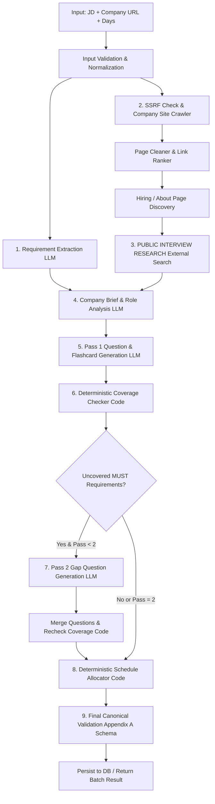

# Generation Pipeline Architecture

## Pipeline Execution Stages & Sequence
1. **Input Normalization**: Sanitize URLs, clean whitespace, validate $N$ days (1..60).
2. **Requirement Extraction**: Parse JD into atomic requirements, tagging `id` (r1, r2...), `text`, `kind` (`technical`|`behavioural`|`domain`), and `priority` (`must`|`nice`).
3. **Company Site Crawl & Discovery**:
   - Resolve URL and check against SSRF guard.
   - Fetch homepage, parse HTML via Cheerio.
   - Rank internal links based on path keywords (`careers`, `jobs`, `about`, `handbook`, `values`, `culture`, `engineering`, `interview`).
   - Fetch top candidate pages up to max limit (5 pages max, 8s timeout, max 500KB per page).
4. **Public Interview Research** (`lib/retrieval/interviewSearch.ts`):
   - Separate external search query for company interview process questions and engineering discussions.
   - Retrieve useful public snippets.
   - If no public discussion exists, record an honest gap (`"No public interview process discussions found."`) without fabricating information.
5. **Company Brief & Role Analysis**:
   - Combine extracted JD facts + scraped pages + public interview research into `company_brief` and `role` breakdown.
6. **Pass 1 Generation**:
   - Model `LLM_MODEL=gemini-3.6-flash` generates questions for each category (`technical`, `behavioural`, `system-design`, `company-fit`) and flashcards (`front`, `back`, `requirement_ids`).
7. **Deterministic Coverage Check**:
   - Compare `requirement_ids` in generated questions against extracted `must` requirement IDs.
8. **Pass 2 Gap Generation (if needed)**:
   - If uncovered `must` requirement IDs exist and pass count < 2, prompt LLM specifically for missing requirements and append gap questions.
9. **Deterministic Schedule Allocation**:
   - Partition questions across exactly $N$ days (`days_available`). Harder and `must` priority questions scheduled earlier. Compute integer minutes.
10. **Canonical Validation**:
    - Validate against Zod `KitSchema` (Appendix A).
